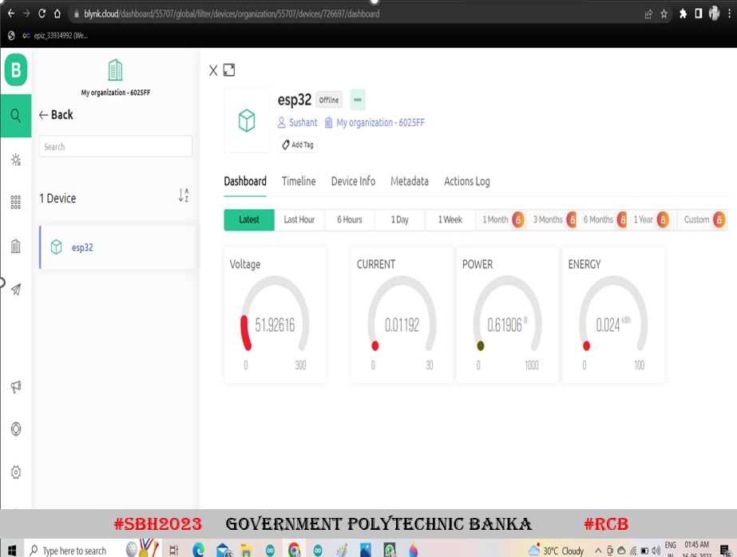

# ⚡ Smart Monitoring System for Wireless Charging of EVs

---

## 🚗 Project Overview

Our **Smart Monitoring System** optimizes and monitors wireless charging for Electric Vehicles (EVs) using **ESP-WROOM-32**, **Arduino UNO**, and the **Blynk mobile app**. Efficient energy management, grid integration, real-time monitoring, and remote control come together to provide a futuristic and sustainable EV charging solution.

This project is developed with mentorship from **Government Polytechnic Banka** under the Smart Bihar Hackathon 2023 initiative.

---

## 🌟 Key Features

- 📶 Wireless real-time data transmission via Wi-Fi  
- ⚡ Dynamic energy management balancing load and grid capacity  
- 📊 Real-time monitoring of charging rates, voltage, and current  
- 📱 Remote control & notifications through Blynk app  
- 🔒 Secure communication & user authentication  
- 🔧 Modular design with ESP32 as main controller and Arduino UNO for sensor interfacing  
- 🚀 Supports demand response and grid-friendly charging schedules  

---

## 📂 Repository Contents

- `Code/` - Arduino and ESP32 source code and libraries guide  
- `Circuit_Diagram/` - Detailed wiring and block diagrams  
- `Images/` - Blynk dashboard and hardware setup photos  
- `Docs/` - Installation steps, project overview, and future work plans  

---

## ⚙️ Installation & Setup

See detailed instructions in [`Docs/Installation_Guide.md`](./Docs/Installation_Guide.md) including:

- Hardware connections and wiring  
- Installing Arduino IDE and required libraries  
- Configuring Wi-Fi and Blynk Authentication  
- Uploading code to ESP32 and Arduino UNO  

---

## 📈 System Architecture

- ESP-WROOM-32: Central controller handling communication and data processing  
- Arduino UNO: Sensor interfacing including voltage, current sensors, and relay control  
- Blynk App: User interface for monitoring and control  

---

## 🔌 Circuit Diagram Highlights

- Separate charging station and EV-side circuits  
- IR sensors for presence detection  
- Relay modules for load switching  
- Tesla coil integration for wireless power transfer  

See full diagrams in [`Circuit_Diagram/`](./Circuit_Diagram/)

---

## 🎯 Future Enhancements

Key plans to enhance system capabilities:

- Dynamic real-time power routing for optimized charging  
- Vehicle-to-Grid (V2G) integration to feed power back to grid  
- AI/ML algorithms for predictive maintenance and optimized charging schedules  
- Enhanced cybersecurity and encryption  
- Smart grid integration for scalable and intelligent infrastructure  

Details available in [`Docs/Future_Enhancements.md`](./Docs/Future_Enhancements.md)

---

## 🙌 Contributors & Acknowledgements

- **Team Royal Coder's Banka (RCB)**  
- Mentored by: Navnit Kumar Singh  
- Participants: Sushant Sagar, Aditya Bharti, Rahul Raj, Piyush Raj  
- Supported by Government Polytechnic Banka under #SBH2023  

---

## 📩 Feedback & Contributions

Contributions, issues, and feedback are welcome! Please open an issue or submit a pull request.

---

*Thank you for exploring our Smart Monitoring System for EV wireless charging! Together, let's drive sustainable innovation. ⚡*

---

